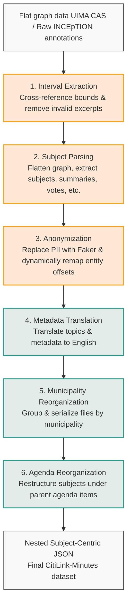

# CitiLink Subject-Centric Data Pipeline

[](LICENSE)
[](https://doi.org/10.1007/978-3-032-21321-1_56)
[](https://doi.org/10.25747/7KG6-1K22)
[](https://dataset.citilink.inesctec.pt)
[](https://citilink.inesctec.pt)


This repository showcases the 6-step automated data processing pipeline developed to transform raw linguistic annotations (UIMA CAS format from INCEpTION) into a structured, anonymized, and translation-normalized subject-centric JSON dataset. 

This pipeline corresponds directly to the structural transformation process described in the dissertation chapter **"The CitiLink-Minutes Dataset"**.

---

## Pipeline Architecture

The transformation process consists of the following six sequential stages:



### 1. Interval Extraction (Data Cleaning)
* **Script:** `scripts/step1_interval_extraction.py`
* **Description:** Cross-references the raw annotations against predefined document boundaries. It removes invalid excerpts or non-deliberative content (marked by "Rodrigo: inicio" and "Rodrigo: fim" boundary annotations) and automatically adjusts all subsequent annotation offsets to maintain data integrity.

### 2. Subject Parsing and Hierarchy Reconstruction
* **Script:** `scripts/step2_subject_parsing.py`
* **Description:** The core transformation stage. Traversing the flat relational graph, it extracts subjects based on boundary markers and links them to their respective agenda items ("Ordem do Dia"). It recursively maps voting methods, explicit voter positioning (in favor, against, abstention, blank), and global tallies, nesting them cleanly within individual subjects and sub-subjects. It also extracts standardized topics, free-text themes, summaries, and categorized personal information.

### 3. Anonymization and Offset Remapping
* **Script:** `scripts/step3_anonymization.py` (supported by `scripts/anonymize_pipeline.py`)
* **Description:** Substitutes PII (categorized into 19 types, such as names, addresses, dates) with contextually accurate synthetic data using the `Faker` library and custom generator functions (tailored to Portuguese nomenclature). It employs a heuristic gender detection module to align synthetic names and job titles grammatically with the original text. Crucially, as replacement string lengths vary, it calculates character length deltas and dynamically recalculates and remaps the `start` and `end` indices for all downstream entities (voting evidence, voter names, tallies) to guarantee consistency across the final JSON dataset.

### 4. Metadata Translation
* **Script:** `scripts/step4_metadata_translation.py`
* **Description:** Programmatically maps and translates domain-specific topics, free-text themes, and metadata fields from Portuguese to English (e.g., translating topic labels via a predefined lookup table of the 22 standardized categories) to broaden the dataset's accessibility.

### 5. Municipality Reorganization
* **Script:** `scripts/step5_municipality_reorganization.py`
* **Description:** Systematically groups and serializes the processed documents into isolated files corresponding to their originating municipality.

### 6. Agenda Item Reorganization
* **Script:** `scripts/step6_agenda_reorganization.py`
* **Description:** Restructures the data into an agenda-centric hierarchy, grouping all deliberative subjects strictly under their parent agenda items to support targeted Information Retrieval tasks.

---

## Directory Structure

```
pipeline/
├── .gitignore                         # Local run files & python environment ignore configs
├── README.md                          # Repository documentation
├── requirements.txt                   # External dependencies
├── run_pipeline.py                    # Main pipeline runner/orchestrator
├── verify_agendas_output.py           # Output structure verification utility
└── scripts/
    ├── step1_interval_extraction.py   # Step 1: Interval extraction script
    ├── step2_subject_parsing.py       # Step 2: Subject parsing script
    ├── step3_anonymization.py         # Step 3: Anonymization remapping runner
    ├── anonymize_pipeline.py          # Step 3: Custom generators and offset adjustment module
    ├── step4_metadata_translation.py  # Step 4: Translation normalization script
    ├── step5_municipality_reorganization.py # Step 5: Grouping by municipality
    └── step6_agenda_reorganization.py # Step 6: Restructuring under agenda items
```

---

## Quick Start

### 1. Prerequisites
Ensure you have Python 3.8+ installed. Set up a virtual environment and install dependencies:

```bash
python -m venv .venv
source .venv/bin/activate
pip install -r requirements.txt
```

### 2. Preparing Folders
The pipeline expects a structured `inputs/` directory in the directory where you run it (configured to match the orchestrator):
* `inputs/annotation_rute/` - Annotation files containing Rodrigo boundary markers (for Step 1).
* `inputs/inception_final/` - Full INCEpTION export JSON files containing subjects and annotations (for Step 1/Step 2).

*Note: Since the source data files contain confidential personal information, they are excluded from this repository and must be placed in `inputs/` locally.*

### 3. Execution

To run the complete 6-step pipeline from end to end:
```bash
python run_pipeline.py
```

To run specific steps (e.g. only Step 1 & 2):
```bash
python run_pipeline.py --step 1 2
```

To preserve original text (skipping synthetic data substitution in Step 3):
```bash
python run_pipeline.py --skip-anonymization
```

To print verbose logging output:
```bash
python run_pipeline.py --debug
```

### 4. Output Verification
To verify that the output structure of Step 6 conforms strictly to the expected schema, run:
```bash
python verify_agendas_output.py
```

---

## Citation

If you use this pipeline or the dataset in your research, please cite:

### Thesis
```bibtex
@mastersthesis{isidrothesis2026,
  author       = {José Miguel Isidro},
  title        = {Text Segmentation of City Council Minutes in European Portuguese},
  school       = {University of Porto},
  year         = {2026}
}
```

### CitiLink-Minutes Dataset
```bibtex
@dataset{citilink2025,
  author       = {Ricardo Campos and Ana Filipa Pacheco and Ana Luísa Fernandes and Inês Cantante and Rute Rebouças and Luís Filipe Cunha and José Isidro and José Evans and Miguel Marques and Rodrigo Batista and Evelin Amorim and Alípio Jorge and Nuno Guimarães and Sérgio Nunes and António Leal and Purificação Silvano},
  title        = {CitiLink-Minutes: A Multilayer Annotated Dataset of Municipal Meeting Minutes},
  year         = {2025},
  doi          = {10.25747/7KG6-1K22},
  url          = {https://doi.org/10.25747/7KG6-1K22},
  institution  = {INESC TEC}
}
```

### CitiLink-Minutes Paper
```bibtex
@inproceedings{citilinkminutes2026,
  author       = {Ricardo Campos and Ana Filipa Pacheco and Ana Luísa Fernandes and Inês Cantante and Rute Rebouças and Luís Filipe Cunha and José Isidro and José Evans and Miguel Marques and Rodrigo Batista and Evelin Amorim and Alípio Jorge and Nuno Guimarães and Sérgio Nunes and António Leal and Purificação Silvano},
  title        = {CitiLink-Minutes: A Multilayer Annotated Dataset of Municipal Meeting Minutes},
  booktitle    = {Advances in Information Retrieval},
  year         = {2026},
  pages        = {511--527},
  publisher    = {Springer Nature Switzerland},
  doi          = {10.1007/978-3-032-21321-1_56},
  url          = {https://doi.org/10.1007/978-3-032-21321-1_56}
}
```
